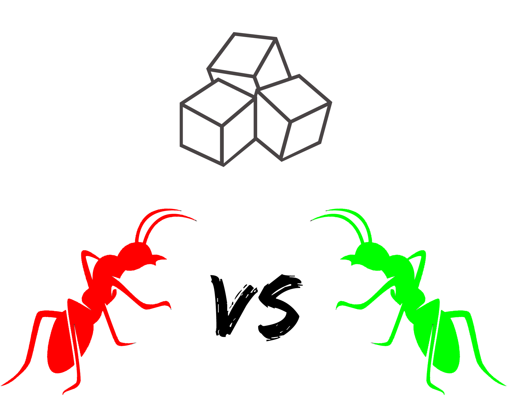

<h1 align="center">
  ant-colony
  <br>
    
  <br>

  <a href="https://lgtm.com/projects/g/Valeran-MAYTIE/ant-colony/alerts/">
  
  </a>
  
  <a href="https://lgtm.com/projects/g/Valeran-MAYTIE/ant-colony/context:cpp">
  
  </a>

</h1>

## Presentation 🐜

### Subject

For this project we had to make a simulation of an ant with several colonies. Here is the subject for those who speak French [subject](./subject.pdf). We have several additions and took some liberty on the subject.

### Why Ant colony


We did this project with [Livarg](https://github.com/Livarg) for the University of Paris Saclay in modular planning for the end of the first year of the bachelor's degree in math and computer science

<div align="center">
  
</div>

<div align="center">
  
</div>

## Get ant colony

#### Required libs and tools:
- cmake
- pkg-config
- sfml 

> If you are using nixos, you can just type ``nix-shell`` inside the directory to open a preconfigured shell

#### Compilation
```sh
cmake .
make
```

## Man

#### Launching ant colony
```
./ant_colony [OPTION] ...
```

|commande|dedescriptions|
|:-:|:-:|
| -h / --help | show command |
| -t / --textures | active textures |
| -m / --man | place colony manualy |
| -c / --colony *number* | number of colony |
| -s / --sugar *number* | number of sugar |
| -l / --largeness *number* | cell dimension |
| -d / --dimension *number number* | grid dimension |

## Code conventions

#### Docstrings
We followed javadocs guidelines with an additional decorator:
``@confidence 0-4``
- 0: it doesn't work
- 1: it "works" with known bugs
- 2: it works but can't be tested
- 3: it works and has been tested
- 4: it works, it has been tested and it is so simple that there is no doubt about it

<div align="center">
  
</div>